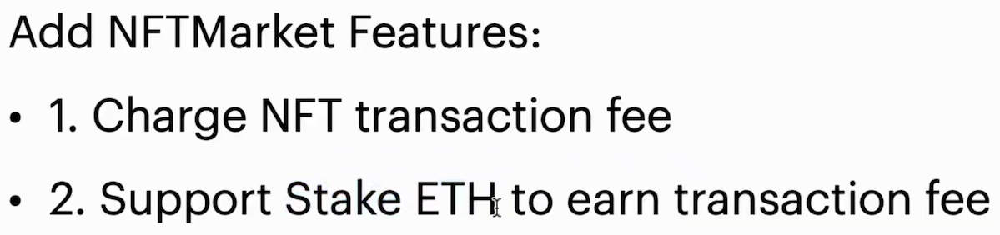

# 带质押的 NFT 交易平台




## 1. 收取 NFT 交易费（Charge NFT transaction fee）

**NFTMarket_V5** 合约中，**交易费率**为固定值 10.0% ，即成交价的 10% 对应的 **WETH** 数量会被作为**交易费**。

```solidity
// {NFTMarket_V5} 合约层，声明状态变量：

// 交易费率的有效数字（常量）
uint8 public constant FIGURE_FEERATIO = 10;
		
// 交易费率的小数点之后的位数（常量），决定费率的精度
uint8 public constant FRACTION_FEERATIO = 2;
```

当**买家**通过合约内的方法 [**{buyNFTWithAnyToken}**](./src/NFTMarket_V5.sol#L238-L252) 、 [**{buyWithPermit}**](./src/NFTMarket_V5.sol#L274-L296) 或 [**{tokensReceived}**](./src/NFTMarket_V5.sol#L175-L190) 成功购买 **NFT** 时， 其间接调用内部方法 [**{_handleNFTPurchase}**](./src/NFTMarket_V5.sol#L816-L868) 或 [**{_handleNFTPurchaseWithSlippage}**](./src/NFTMarket_V5.sol#L874-L922) （两者在实现用任意 **ERC-20 token** 购买 **NFT** 的方式略有不同），会将卖出 **NFT** 的收益的一部分作为质押的收益（利息）。由于本合约同时实现了“[**单利质押**](#simple_stake)”和“[**复利质押**](#compound_stake)”，因此将会有“**双份**”的费率被同时收取（其中，若“[**单利质押**](#simple_stake)”的质押池为 0，则其对应的**交易费**不会被加入质押，以避免这部分 **WETH** 锁死在合约中无法取出）。

----

### 1-1. 方法 {_handleNFTPurchase}：加入了“将售卖 NFT 的部分收益自动转入质押”的机制

```solidity
// 此内部方法由方法 {buyWithPermit} 和 {tokensReceived} 调用，将调用者给出的任意 ERC-20 token 投入 swap 并购买 NFT
// 根据 NFT 价格确定实际所需 token 数量，将多余的 token 返还给买家（与{_handleNFTPurchaseWithSlippage}的逻辑不同）
// 其中包含了将卖出 NFT 的部分收益质押到本合约的质押池（“单利质押”和“复利质押”两个相互隔离的质押池）中
function _handleNFTPurchase(address _nftBuyer, address _ERC20TokenAddr, address _nftAddr, uint256 _tokenId, uint256 _tokenAmount) internal returns (uint256 result) {
    uint256 NFTPrice = getNFTPrice(_nftAddr, _tokenId);
    // 检查给定的 ERC-20 token 是否为 WETH
    if (_ERC20TokenAddr != wrappedETHAddr) {
        // 当 ERC-20 token 不为 WETH 时：
        // 转入`_tokenAmount`数量的 ERC-20 token
        bool _success = IERC20(_ERC20TokenAddr).transferFrom(_nftBuyer, address(this), _tokenAmount);
        require(_success, "ERC-20 token transferFrom failed");
        // 将给定的 ERC-20 token 兑换为 WETH
        uint256 tokenBalanceBeforeSwap = IERC20(_ERC20TokenAddr).balanceOf(address(this));
        uint256 tokenAmountPaid = _swapTokenForExactWETH(_ERC20TokenAddr, NFTPrice, _tokenAmount);
        uint256 tokenBalanceAfterSwap = IERC20(_ERC20TokenAddr).balanceOf(address(this));
        // 验证 swap 实际所需要的 token 数量（考虑滑点）与 token 的实际的减少量相等，否则回滚交易
        if (tokenBalanceAfterSwap >= tokenBalanceBeforeSwap || tokenBalanceBeforeSwap - tokenBalanceAfterSwap != tokenAmountPaid) {
            address[] memory _path = new address[](2);
            _path[0] = _ERC20TokenAddr;
            _path[1] = wrappedETHAddr;
            revert tokenSwapFailed(_path, NFTPrice, _tokenAmount);
        }
        // 将买家多给的 token 返还
        uint256 refundTokenAmount = _tokenAmount - tokenAmountPaid;
        bool _refundTokenSuccess = IERC20(_ERC20TokenAddr).transfer(_nftBuyer, refundTokenAmount);
        require(_refundTokenSuccess, "Fail to refund exceed amount of token");
        // 确认最终的成交价为`tokenAmountPaid`个给定的 ERC-20 token
        result = tokenAmountPaid;
    } else {
        // 当 ERC-20 token 为 WETH 时：
        // 转入与 NFT 价格等额的 WETH
        bool _ok = IWETH9(wrappedETHAddr).transferFrom(_nftBuyer, address(this), NFTPrice);
        require(_ok, "WETH transferFrom failed");
        // 确认最终的成交价为`NFTPrice`个 WETH
        result = NFTPrice;
    }
    // 将 NFT 从本合约转给买家（注：上架后的 NFT 的 owner 是本合约）
    IERC721(_nftAddr).transferFrom(address(this), _nftBuyer, _tokenId);
    // 获取 NFT 卖家（前持有者）
    address NFTOwner = IERC721(_nftAddr).getApproved(_tokenId);

    // 质押方法 1：单利质押
    // 声明变量`stakedAmount_Simple`表示参与单利质押的 WETH 数额
    uint256 stakedAmount_Simple;
    // 当单利质押池中的 WETH 数量为 0 时，则不会自动将该部分的 NFT 收益转入质押池内（即`stakedAmount_Simple`为默认值 0 ，避免这部分 WETH 锁死在合约中无法取出）
    if (stakePool_SimpleStake != 0) {
        stakedAmount_Simple = NFTPrice * FIGURE_FEERATIO / (10 ** FRACTION_FEERATIO);
        // 更新“单份质押的收益率”
        _updateInterest_SimpleStake(stakedAmount_Simple);
    }

    // 质押方法 2：复利质押
    uint256 stakedAmount_Compound = NFTPrice * FIGURE_FEERATIO / (10 ** FRACTION_FEERATIO);
    _stakeWETH_CompoundStake(NFTOwner, stakedAmount_Compound);
    // 将售卖 NFT 的剩余收益添加到本合约中的卖家的 WETH 余额内
    userBalanceOfWETH[NFTOwner] += NFTPrice - stakedAmount_Simple - stakedAmount_Compound;
    // 重置 NFT 价格（售价将被设为默认值 0，即表示未上架）
    delete price[_nftAddr][_tokenId];
}
```

-----

### 1-2. 方法 [{_handleNFTPurchaseWithSlippage}](./src/NFTMarket_V5.sol#L874-L922) ：加入了“将售卖 NFT 的部分收益自动转入质押（考虑滑点）”的机制

```solidity
// 此内部方法由方法 {buyNFTWithAnyToken} 调用，将调用者给出的任意 ERC-20 token 投入 swap 并购买 NFT
// 根据 NFT 价格确定实际所需的 token 数量（前置调用内部方法 {_estimateAmountInWithSlipage}，计算出考虑滑点的所需 token 的数量），再向买家收取此数量的 token
// 其中包含了将卖出 NFT 的部分收益质押到本合约的质押池（“单利质押”和“复利质押”两个相互隔离的质押池）中
function _handleNFTPurchaseWithSlippage(address _nftBuyer, address _ERC20TokenAddr, address _nftAddr, uint256 _tokenId, uint256 _slippageFigure, uint256 _slippageFraction) internal returns (uint256 result) {
    uint256 NFTPrice = getNFTPrice(_nftAddr, _tokenId);
    // 检查给定的 ERC-20 token 是否为 WETH
    if (_ERC20TokenAddr != wrappedETHAddr) {
        // 当 ERC-20 token 不为 WETH 时：
        // 调用 {_estimateAmountInWithSlipage} 计算应当转入的 token 数量
        uint256 amountInRequired = _estimateAmountInWithSlipage(_ERC20TokenAddr, NFTPrice, _slippageFigure, _slippageFraction);
        // 转入`_tokenAmount`数量的 ERC-20 token
        bool _success = IERC20(_ERC20TokenAddr).transferFrom(_nftBuyer, address(this), amountInRequired);
        require(_success, "ERC-20 token transferFrom failed");
        // 将给定的 ERC-20 token 兑换为 WETH
        uint256 tokenBalanceBeforeSwap = IERC20(_ERC20TokenAddr).balanceOf(address(this));
        uint256 tokenAmountPaid = _swapTokenForExactWETH(_ERC20TokenAddr, NFTPrice, amountInRequired);
        uint256 tokenBalanceAfterSwap = IERC20(_ERC20TokenAddr).balanceOf(address(this));
        // 验证 swap 实际所需要的 token 数量（考虑滑点）与 token 的实际的减少量相等，否则回滚交易
        if (tokenBalanceAfterSwap >= tokenBalanceBeforeSwap || tokenBalanceBeforeSwap - tokenBalanceAfterSwap != tokenAmountPaid) {
            address[] memory _path = new address[](2);
            _path[0] = _ERC20TokenAddr;
            _path[1] = wrappedETHAddr;
            revert tokenSwapFailed(_path, NFTPrice, amountInRequired);
        }
        // 确认最终的成交价为`tokenAmountPaid`个给定的 ERC-20 token
        result = tokenAmountPaid;
    } else {
        // 当 ERC-20 token 为 WETH 时：
        // 转入与 NFT 价格等额的 WETH
        bool _ok = IWETH9(wrappedETHAddr).transferFrom(_nftBuyer, address(this), NFTPrice);
        require(_ok, "WETH transferFrom failed");
        // 确认最终的成交价为`NFTPrice`个 WETH
        result = NFTPrice;
    }
    // 将 NFT 从本合约转给买家（注：上架后的 NFT 的 owner 是本合约）
    IERC721(_nftAddr).transferFrom(address(this), _nftBuyer, _tokenId);
    // 获取 NFT 卖家（前持有者）
    address NFTOwner = IERC721(_nftAddr).getApproved(_tokenId);

    // 质押方法 1：单利质押
    // 声明变量`stakedAmount_Simple`表示参与单利质押的 WETH 数额
    uint256 stakedAmount_Simple;
    // 当单利质押池中的 WETH 数量为 0 时，则不会自动将该部分的 NFT 收益转入质押池内（即`stakedAmount_Simple`为默认值 0 ，避免这部分 WETH 锁死在合约中无法取出）
    if (stakePool_SimpleStake != 0) {
        stakedAmount_Simple = NFTPrice * FIGURE_FEERATIO / (10 ** FRACTION_FEERATIO);
        _updateInterest_SimpleStake(stakedAmount_Simple);
    }

    // 质押方法 2：复利质押
    uint256 stakedAmount_Compound = NFTPrice * FIGURE_FEERATIO / (10 ** FRACTION_FEERATIO);
    _stakeWETH_CompoundStake(NFTOwner, stakedAmount_Compound);
    // 将售卖 NFT 的剩余收益添加到本合约中的卖家的 WETH 余额内
    userBalanceOfWETH[NFTOwner] += NFTPrice - stakedAmount_Simple - stakedAmount_Compound;
    // 重置 NFT 价格（售价将被设为默认值 0，即表示未上架）
    delete price[_nftAddr][_tokenId];
}
```

<br />


## 2. 支持质押 ETH 来赚取交易费（Support Stake ETH to earn transaction fee）

由于 [**NFTMarket_V5**](./src/NFTMarket_V5.sol) 合约中用于 **NFT** 交易的 token 为 **WETH**，且 **WETH** 的价值等同于 **ETH**，因此本合约采用 **WETH** 作为质押代币。质押的利息来自于合约内 **NFT** 交易所产生的**交易费**。本合约内同时实现了**两种独立的质押方式**：

- <a name="simple_stake">**单利质押**（***stake with simple interest***，简称 ***simple stake***）</a>：仅可以通过方法 [**{stakeWETH_SimpleStake}**](./src/NFTMarket_V5.sol#L468-L483) 进行此类型的质押，也仅可通过方法 [**{unstakeWETH_SimpleStake}**](./src/NFTMarket_V5.sol#L493-L511) 解除质押。该类型的质押所产生的利息不再投入到本金中，即利息为单利。因此，此类型的质押，全局维护一个“**单份质押的收益率**”即可。以下为计算该类型质押收益相关的关键数据：
  - “**单份质押的收益率**”：表示每份质押的 **WETH** 所对应的收益。该数据仅在有**交易费**进入时产生变化（仅增加，不存在减少的可能），此数据无实时更新的必要性（减少 gas 和其他资源的消耗）。
  - “**质押本金**”（principal）：即用于产生收益的本金，也是分配收益的份额（也可视为股份）。仅受方法  [**{stakeWETH_SimpleStake}**](./src/NFTMarket_V5.sol#L468-L483) 和方法 [**{unstakeWETH_SimpleStake}**](./src/NFTMarket_V5.sol#L493-L511) 影响，不受利息影响（因为是单利）。
  - **用户的收益**（或称为**个人利息**）：在用户的“**质押本金**”更新时，应当**结算**一次用户当前所获得的**收益总额**，即“**单份质押的收益率**”与改变之前的“**质押本金**”的乘积。改变之后的“**质押本金**”将用于下一次**结算**，将用户“各**质押本金**下的**收益总额**”加总之后即为用户的**总收益**（**总利息**）。
- <a name="compound_stake">**复利质押**（***stake with compound interest***，简称 ***compound stake***）</a>：质押所产生的收益（利息）将被投入到本金中，用作后续生息的本金，即利息为复利。当买家通过合约内的方法  [**{buyNFTWithAnyToken}**](./src/NFTMarket_V5.sol#L238-L252) 、 [**{buyWithPermit}**](./src/NFTMarket_V5.sol#L274-L296) 或 [**{tokensReceived}**](./src/NFTMarket_V5.sol#L175-L190) 成功购买 **NFT** 时，则卖家收益中的部分（作为卖家的本金，比例同上）会被自动质押到本合约中的**质押池**中，用户也可通过调用方法 [**{stakeWETH_CompoundStake}**](./src/NFTMarket_V5.sol#L556-L571) 参与此类型的质押。凡是参与此类型质押的用户都会获得 **KKToken**（一种 **ERC-20 token**，视为**质押凭证**或**股份**），获得的 **KKToken** 数量根据新质押的 **WETH** 数量而确定，其算法参考了 **ERC4626** 中的算法，即股份数量的变化率等同于质押数量的变化率。方法 [**{unstakeWETH_CompoundStake}**](./src/NFTMarket_V5.sol#L584-L594) 通过销毁指定数量的 **KKToken** 来返还对应的本息，其算法为前者的逆运算。

---

### 2-1. 单利质押的实现

#### a. 当发生 NFT 交易时产生交易费并将其部分作为收益

**单利质押的收益**来自于 **NFT** 交易时产生**交易费**，由**单份质押收益率**所体现，即前文提到的 [**{_handleNFTPurchase}**](./src/NFTMarket_V5.sol#L816-L868) 和 [**{_handleNFTPurchaseWithSlippage}**](./src/NFTMarket_V5.sol#L874-L922) 调用内部方法 [**{_updateInterest_SimpleStake}**](./src/NFTMarket_V5.sol#L969-L973) ，以此更新**单份质押收益率**。

为了避免“**交易费**较小且**质押池**内资金较大而导致**单份质押收益率**的更新存在严重精度损失”的问题，方法  [**{_updateInterest_SimpleStake}**](./src/NFTMarket_V5.sol#L969-L973) 声明常量 [**MANTISSA**](./src/NFTMarket_V5.sol#L41) 作为乘数因子计算**调整后的单份质押收益率**（即 [**stakeInterestAdjusted**](./src/NFTMarket_V5.sol#L48)）。

```solidity
function _updateInterest_SimpleStake(uint256 _value) internal {
    if (stakePool_SimpleStake != 0) {
        stakeInterestAdjusted += _value * MANTISSA / stakePool_SimpleStake;
    }
}
```

#### b. 声明状态变量记录单利质押的关键数据：

```solidity
// -------------------------- 接口 {INFTMarket_V5} 中声明的结构体 --------------------------
// 自定义结构体：用户的单利质押信息结构体
struct stakerOfSimpleStake {
    // 用户质押的本金数量
    uint256 principal;

    // “结算点”使用的“调整后的单份质押收益率”（即“单份质押收益率” * MANTISSA ）
    uint256 accrualInterestAdjusted;

    // 用户获得的总收益（总利息）
    uint256 earned;
}
      
// -------------------- {NFTMarket_V5}（继承了 {INFTMarket_V5} ）合约层 --------------------
// 避免较小的数字在被较大的数字除时造成计算结果的严重的精度丢失而使用的乘数因子
// 当 NFT 售卖所产生的交易费较低且质押池中的数额巨大时，此常量可以起到缓解“单份质押收益率”更新存在精度丢失的问题
uint256 public constant MANTISSA = 1e18;

// 用户的单利质押信息结构体
mapping(address account => stakerOfSimpleStake stakerStruct) public staker; 

// 调整后的单份质押的收益率，即单份质押的收益率 * MANTISSA
uint256 public stakeInterestAdjusted;

// 单利质押池中的 WETH 总数量
uint256 public stakePool_SimpleStake;
```

#### c. 方法 {stakeETH_SimpleStake}：质押 ETH

```solidity
function stakeETH_SimpleStake() public payable {
    uint256 _stakedAmount = msg.value;
    if (_stakedAmount == 0) {
        revert stakeZero();
    }
    // 更新用户获得的总收益（总利息）
    // 当用户第一次质押 WETH 时，由于之前存入的本金为 0 ，故此时更新后的收益也为 0 。
    staker[msg.sender].earned += staker[msg.sender].principal * (stakeInterestAdjusted - staker[msg.sender].accrualInterestAdjusted) / MANTISSA;

    // 将用户转入的 ETH 存入 WETH 合约，转为本合约的 WETH
    IWETH9(wrappedETHAddr).deposit{value: _stakedAmount}();

    // 更新用户的质押本金
    staker[msg.sender].principal += _stakedAmount;

    // 更新用户此次结算时所使用的“调整后的单份质押收益率”（即“单份质押收益率” * MANTISSA ）
    staker[msg.sender].accrualInterestAdjusted = stakeInterestAdjusted;

    // 更新质押池的金额（单利质押池与复利质押池之间相互隔离）
    stakePool_SimpleStake += _stakedAmount;
    emit WETHStaked_SimpleStake(msg.sender, _stakedAmount, stakeInterestAdjusted);
}
```

#### d. 方法 {stakeWETH_SimpleStake}：质押 WETH

```solidity
function stakeWETH_SimpleStake(uint256 _stakedAmount) public {
    if (_stakedAmount == 0) {
        revert stakeZero();
    }
    // 更新用户获得的总收益（总利息）
    // 当用户第一次质押 WETH 时，由于之前存入的本金为 0 ，故此时更新后的收益也为 0 。
    staker[msg.sender].earned += staker[msg.sender].principal * (stakeInterestAdjusted - staker[msg.sender].accrualInterestAdjusted) / MANTISSA;

    // 将用户的 WETH 转入本合约中（需要提前授权本合约足够的 allowance）
    IWETH9(wrappedETHAddr).transferFrom(msg.sender, address(this), _stakedAmount);

    // 更新用户的质押本金
    staker[msg.sender].principal += _stakedAmount;

    // 更新用户此次结算时所使用的“调整后的单份质押收益率”（即“单份质押收益率” * MANTISSA ）
    staker[msg.sender].accrualInterestAdjusted = stakeInterestAdjusted;

    // 更新质押池的金额（单利质押池与复利质押池之间相互隔离）
    stakePool_SimpleStake += _stakedAmount;
    emit WETHStaked_SimpleStake(msg.sender, _stakedAmount, stakeInterestAdjusted);
}
```


#### e. 方法 {unstakeWETH_SimpleStake}：解除质押 WETH

可通过本方法（全部/部分）提取质押的本金和对应的收益到本合约的 WETH 账户，用户可以再通过 {withdrawFromWETHBalance} 提取 ETH 到自己的账户中。

```solidity
function unstakeWETH_SimpleStake(uint256 _unstakeAmount) public {
    if (_unstakeAmount == 0 || _unstakeAmount > staker[msg.sender].principal) {
        revert invalidUnstakedAmount();
    }
    // 更新用户获得的总收益（总利息）
    staker[msg.sender].earned += staker[msg.sender].principal * (stakeInterestAdjusted - staker[msg.sender].accrualInterestAdjusted) / MANTISSA;

    // 计算用户提取的本金数量所对应的收益（利息）
    uint256 correspondingInterest = _unstakeAmount * staker[msg.sender].earned / staker[msg.sender].principal;

    // 根据所提取的本金和收益数量，为用户增加相应的 WETH 余额
    userBalanceOfWETH[msg.sender] += _unstakeAmount + correspondingInterest;

    // 更新结构体`staker`中的各个字段
    // 根据所计算出的收益（利息）从用户总收益（总利息）中减少相应的 WETH 数量
    staker[msg.sender].earned -= correspondingInterest;

    // 根据所提取的本金数量，减少相应数量的用户本金
    staker[msg.sender].principal -= _unstakeAmount;

    // 更新用户此次结算时所使用的“调整后的单份质押收益率”（即“单份质押收益率” * MANTISSA ）
    staker[msg.sender].accrualInterestAdjusted = stakeInterestAdjusted;

    // 更新质押池内的 WETH 数量
    stakePool_SimpleStake -= _unstakeAmount;
    emit WETHUnstaked_SimpleStake(msg.sender, _unstakeAmount, stakeInterestAdjusted);
}
```

```solidity
// 提取 ETH 的方法：
function withdrawFromWETHBalance(uint256 _value) external {
    if (_value > userBalanceOfWETH[msg.sender]) {
        revert withdrawalExceedBalance(_value, userBalanceOfWETH[msg.sender]);
    }
    userBalanceOfWETH[msg.sender] -= _value;

    // 调用 WETH 的 {withdraw} 方法将 ETH 转入本合约
    IWETH9(wrappedETHAddr).withdraw(_value);

    // 本合约再将等额的 ETH 转入此方法调用者的地址
    (bool _success, ) = payable(msg.sender).call{value: _value}("");
    require(_success, "withdraw ETH failed");
    emit ETHWithdrawn(msg.sender, _value);
}
```

---

### 2-2. 复利质押的实现

算法简述如下：

```solidity
// -------------------------------------- 新增质押 --------------------------------------
// T：股份的总数量（即现存的 KKToken 总供应量）
// s：待被铸造的股份数量
// B：质押池内的 WETH 总数量
// a：新质押 的 WETH 数量
	
// 新增质押并铸造新股份：新铸造的股份数量的算法：(T + s) / T = (a + B) / B
// 代数运算后，得到：s = aT / B
	
// -------------------------------------- 解除质押 --------------------------------------

// T：股份的总数量（即现存的 KKToken 总供应量）
// s：待被销毁的股份数量
// B：质押池内的 WETH 总数量
// a：提取的 WETH 数量

// 销毁股份并提取对应的本息：提取本息数量的算法：(T - s) / T = (B - a) / B
// 代数运算后，得到：a = sB / T
```


#### a. 声明状态变量记录复利质押的关键数据：

```solidity
// {NFTMarket_V5} 合约层，声明状态变量：
// 复利质押池中的 WETH 总数量
uint256 public stakePool_CompoundStake;  
```


#### b. 方法 {stakeETH_CompoundStake}：质押 ETH

```solidity
function stakeETH_CompoundStake() public payable {
    uint256 _stakedAmount = msg.value;
    if (_stakedAmount == 0) {
        revert stakeZero();
    }
    uint256 shares;
    uint256 totalSupply = KKToken(KKToken_CompoundStake).totalSupply();
    if (totalSupply == 0) {
        shares = _stakedAmount;
    } else {
        // 计算应当铸造的股份（KKToken）数量
        shares = (_stakedAmount * totalSupply) / stakePool_CompoundStake;
    }
    // 将用户转入的 ETH 转化为本合约的 WETH
    IWETH9(wrappedETHAddr).deposit{value: _stakedAmount}();
    KKToken(KKToken_CompoundStake).mint(msg.sender, shares);
    stakePool_CompoundStake += _stakedAmount;
    emit WETHStaked_CompoundStake(msg.sender, _stakedAmount, shares);
}
```


#### c. 方法 {stakeWETH_CompoundStake}：质押 WETH

```solidity
function stakeWETH_CompoundStake(uint256 _stakedAmount) public {
    if (_stakedAmount == 0) {
        revert stakeZero();
    }
    uint256 shares;
    uint256 totalSupply = KKToken(KKToken_CompoundStake).totalSupply();
    if (totalSupply == 0) {
        shares = _stakedAmount;
    } else {
        // 计算应当铸造的股份（KKToken）数量
        shares = (_stakedAmount * totalSupply) / stakePool_CompoundStake;
    }
    // 将用户转入的 WETH 转入本合约
    IWETH9(wrappedETHAddr).transferFrom(msg.sender, address(this), _stakedAmount);
    KKToken(KKToken_CompoundStake).mint(msg.sender, shares);
    stakePool_CompoundStake += _stakedAmount;
    emit WETHStaked_CompoundStake(msg.sender, _stakedAmount, shares);
}
```


#### d. 方法 {unstakeWETH_CompoundStake}： 解除质押 WETH

```solidity
function unstakeWETH_CompoundStake(uint256 _sharesAmount) public {
        if (_sharesAmount == 0) {
            revert invalidUnstakedAmount();
        }
        uint256 totalSupply = KKToken(KKToken_CompoundStake).totalSupply();
        // 计算应当提取的 WETH 的数量
        uint amount = (_sharesAmount * stakePool_CompoundStake) / totalSupply;
        
        // 将股份（KKToken）销毁
        KKToken(KKToken_CompoundStake).burn(msg.sender, _sharesAmount);
        stakePool_CompoundStake -= amount;
        
        // 增加用户的 WETH 余额
        userBalanceOfWETH[msg.sender] += amount;
        emit WETHUnstaked_CompoundStake(msg.sender, _sharesAmount, amount);
    }
```

<br />


> [!NOTE]
>
> **部分文件解释**：
>
> - [**INFTMarket_V5**](./src/interfaces/INFTMarket_V5.sol)：**NFTMarket** 的结构体、事件、错误信息、接口
>
> - [**NFTMarket_V5**](./src/NFTMarket_V5.sol)：**NFTMarket** 的方法
>
> - [**三种计息方式的算法实现举例表格**](./三种计息方式的算法实现举例.xlsx)：三种计息方式的计算参考


------------------------------------------------------ **END** ------------------------------------------------------
